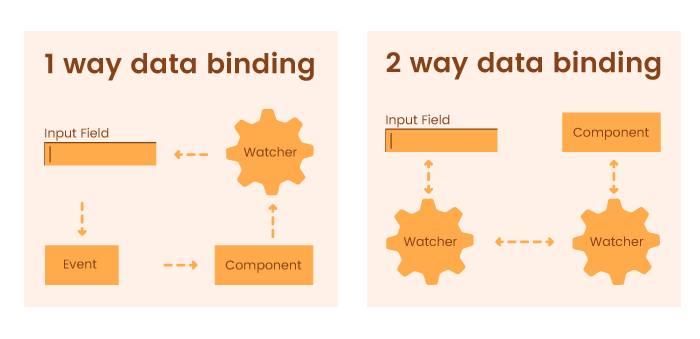
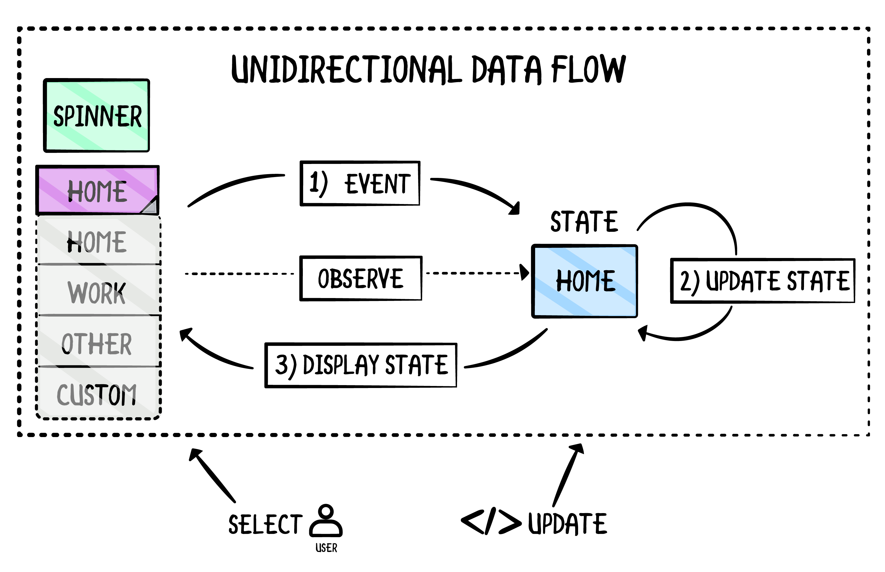
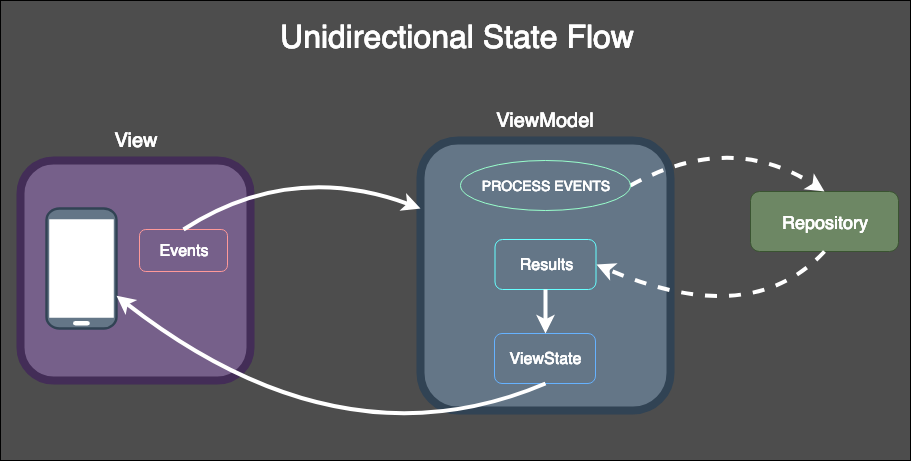
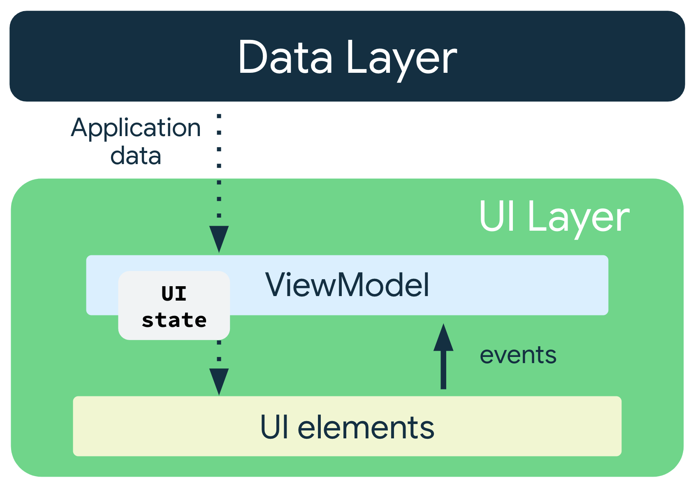

# Programación - 09 Programación Interactiva e Interfaces Gráficas de Usuario

Tema 09 Programación Interactiva e Interfaces Gráficas de Usuario. 1DAW. Curso 2024/2025.


- [Programación - 09 Programación Interactiva e Interfaces Gráficas de Usuario](#programación---09-programación-interactiva-e-interfaces-gráficas-de-usuario)
  - [Contenidos](#contenidos)
  - [Patrón Observer y Eventos](#patrón-observer-y-eventos)
    - [Patrón Observer](#patrón-observer)
    - [Eventos](#eventos)
  - [Interfaz de Usuario](#interfaz-de-usuario)
  - [Arquitecturas con Interfaces Gráficas de Usuario](#arquitecturas-con-interfaces-gráficas-de-usuario)
    - [MVC/MVP](#mvcmvp)
    - [MVVM](#mvvm)
  - [Introducción a JavaFX](#introducción-a-javafx)
    - [Creación de un proyecto JavaFX](#creación-de-un-proyecto-javafx)
      - [Ajustando Versiones](#ajustando-versiones)
      - [Módulos](#módulos)
    - [Diseño de la interfaz de usuario](#diseño-de-la-interfaz-de-usuario)
    - [Controlador](#controlador)
    - [Carga de la interfaz de usuario y ejecución](#carga-de-la-interfaz-de-usuario-y-ejecución)
    - [Arquitectura de de una aplicación JavaFX](#arquitectura-de-de-una-aplicación-javafx)
      - [Stage y Scene](#stage-y-scene)
      - [Nodos y Scene Graph](#nodos-y-scene-graph)
    - [Ciclo de vida de una aplicación JavaFX](#ciclo-de-vida-de-una-aplicación-javafx)
    - [Layouts](#layouts)
    - [Componentes](#componentes)
    - [Eventos](#eventos-1)
    - [Reactividad y Observables](#reactividad-y-observables)
      - [Observables](#observables)
      - [Propiedades](#propiedades)
      - [Data Binding](#data-binding)
      - [Data Binding y Flow Data](#data-binding-y-flow-data)
    - [Inyección de los elementos de una interfaz con el Controlador](#inyección-de-los-elementos-de-una-interfaz-con-el-controlador)
      - [Constructor e Inicialización](#constructor-e-inicialización)
    - [Navegación entre vistas](#navegación-entre-vistas)
    - [Pasando datos entre vistas y escenas](#pasando-datos-entre-vistas-y-escenas)
    - [Cambiando estilos y temas](#cambiando-estilos-y-temas)
    - [Trabajo en segundo plano](#trabajo-en-segundo-plano)
    - [Tutoriales y referencias](#tutoriales-y-referencias)
  - [Introducción a Compose for Desktop](#introducción-a-compose-for-desktop)
  - [Autor](#autor)
    - [Contacto](#contacto)
  - [Licencia de uso](#licencia-de-uso)

## Contenidos

1. Patrón Observer y Eventos
2. Interfaces Usuario
3. Arquitecturas con Interfaces Gráficas de Usuario
4. Interfaz de Usuario
5. Introducción a JavaFX
6. Introducción a Compose for Desktop

## Patrón Observer y Eventos

### Patrón Observer

El [patrón Observer](https://refactoring.guru/es/design-patterns/observer) es un patrón de diseño que permite que un objeto notifique a otros objetos de cualquier cambio de estado que sufra. Este patrón se basa en la idea de que un objeto (el sujeto) mantiene una lista de sus dependientes (observadores), y los notifica automáticamente de cualquier cambio de estado. Los observadores pueden registrarse y cancelar su registro en cualquier momento. Es la base de la programación reactiva y de los eventos.

```kotlin
interface Observer {
    fun update()
}

class Subject {
    private val observers = mutableListOf<Observer>()

    fun addObserver(observer: Observer) {
        observers.add(observer)
    }

    fun removeObserver(observer: Observer) {
        observers.remove(observer)
    }

    fun notifyObservers() {
        observers.forEach { it.update() }
    }
}

class ConcreteObserver : Observer {
    override fun update() {
        println("Observer notified")
    }
}

fun main() {
    val subject = Subject()
    val observer = ConcreteObserver()
    subject.addObserver(observer)
    subject.notifyObservers()
}
```

### Eventos

Un evento es una acción que se produce, pero que no sabemos cuándo, lo que sí sabemos es que cuando se produzca debemos reaccionar a dicho acontecimiento.

Los eventos son las acciones que puede realizar el usuario, al realizar un evento se produce una serie de acciones. Por ejemplo, si el usuario pulsa un botón , poder mostrar un saludo o analizar qué tecla se está pulsando al introducir texto.

Los Listeners se encargan de controlar los eventos, esperan a que el evento se produzca y realiza una serie de acciones. Según el evento, necesitaremos un Listener que lo controle.

Cada Listener tiene una serie de métodos que debemos implementar obligatoriamente, aunque solo queramos usar uno solo de ellos.

Al final son observadores que ejecutan una acción cuando se produce un evento. Y esta es la base de la programación interactiva.

```kotlin
// Creamos una interfaz que implemente un derivado de Listener
class PersonListener : PropertyChangeListener {
    // Sobreescribimos el método que queremos usar
    override fun propertyChange(evt: PropertyChangeEvent) {
        println("Property ${evt.propertyName} changed from ${evt.oldValue} to ${evt.newValue}")
    }
}

// Creamos una clase que queremos observar,
class Person {

    // Observamos una propiedad
    var name: String by Delegates.observable("No name") { _, old, new ->
        // Cuando cambie la propiedad, notificamos a los observadores
        changeSupport.firePropertyChange("name", old, new)
    }

    private val changeSupport = PropertyChangeSupport(this)

    fun addPropertyChangeListener(listener: PropertyChangeListener) {
        changeSupport.addPropertyChangeListener(listener)
    }

    fun removePropertyChangeListener(listener: PropertyChangeListener) {
        changeSupport.removePropertyChangeListener(listener)
    }
}

fun main() {
    val person = Person()
    val listener = PersonListener()
    person.addPropertyChangeListener(listener)
    person.name = "John"
    person.name = "Jane"
}
```

Podemos ver un ejemplo con un botón

```kotlin
// Creamos una interfaz que implemente un derivado de Listener
class ButtonListener : ActionListener {
    // Sobreescribimos el método que queremos usar
    override fun actionPerformed(e: ActionEvent) {
        println("Button clicked")
    }
}

// Creamos una clase que queremos observar,
class Button {
    private val actionListeners = mutableListOf<ActionListener>()

    fun addActionListener(listener: ActionListener) {
        actionListeners.add(listener)
    }

    fun removeActionListener(listener: ActionListener) {
        actionListeners.remove(listener)
    }

    fun click() {
        actionListeners.forEach { it.actionPerformed(ActionEvent(this, 0, "click")) }
    }
}

fun main() {
    val button = Button()
    val listener = ButtonListener()
    button.addActionListener(listener)
    button.click()
}
```

## Interfaz de Usuario

La interfaz de usuario (IU) es la parte de un sistema informático que permite al usuario interactuar con él. La interfaz de usuario es el punto de encuentro entre el usuario y el sistema, y es la que determina la forma en que el usuario interactúa con el sistema.

La interfaz gráfica de usuario (GUI) es la interfaz de usuario que permite al usuario interactuar con un sistema informático a través de gráficos en pantalla. En lugar de utilizar texto, la GUI utiliza gráficos, como ventanas, iconos, menús, botones, barras de desplazamiento, etc.

En el mundo de la JVM existen distintas bibliotecas de componentes gráficos.

AWT es la biblioteca de componentes gráficos de Java más antigua, mientras que Swing es una alternativa a AWT que se introdujo en Java 1.2. Aunque AWT es más antigua, Swing es más popular y se usa más a menudo. Un ejemplo de aplicación Swing es IntelliJ IDEA.

```kotlin

fun main() {
    val frame = JFrame("My First Swing App")
    frame.defaultCloseOperation = JFrame.EXIT_ON_CLOSE
    frame.setSize(300, 300)
    val panel = JPanel()
    val button = JButton("Click Me")
    button.addActionListener {
        println("Button clicked")
    }
    panel.add(button)
    frame.contentPane = panel
    frame.isVisible = true
}
```

Por otro lado tenemos JavaFX, que es una biblioteca de componentes gráficos de Java más moderna que Swing. JavaFX es una familia de productos y tecnologías de Oracle Corporation (inicialmente Sun Microsystems), para la creación de Rich Internet Applications (RIAs), esto es, aplicaciones web que tienen las características y capacidades de aplicaciones de escritorio, incluyendo aplicaciones multimedia interactivas. Usan XML para definir la interfaz de usuario y CSS para definir la apariencia de los componentes.

```kotlin

class Main : Application() {
    override fun start(primaryStage: Stage) {
        val button = Button()
        button.text = "Click Me"
        button.setOnAction {
            println("Button clicked")
        }
        val root = StackPane()
        root.children.add(button)
        primaryStage.scene = Scene(root, 300.0, 250.0)
        primaryStage.show()
    }
}

fun main() {
    Application.launch(Main::class.java)
}
```

[Compose](https://www.jetbrains.com/es-es/lp/compose-multiplatform/), es un marco de trabajo declarativo para compartir interfaces de usuario en varias plataformas. Basado en Kotlin y Jetpack Compose. Para ello usa DSL (Domain Specific Language) y programación declarativa para definir la interfaz de usuario. Un ejemplo de aplicación Compose es [Jetpack Compose](https://developer.android.com/jetpack/compose). Ejemplos los tienes con Twitter o Spotify.

```kotlin
// example button with text and click Compose
@Composable
fun Button(text: String, onClick: () -> Unit) {
    Button(onClick = onClick) {
        Text(text)
    }
}

fun main() {
    Window(onCloseRequest = ::exitApplication) {
        Button(text = "Click Me") {
            println("Button clicked")
        }
    }
}
```

## Arquitecturas con Interfaces Gráficas de Usuario

### MVC/MVP

La arquitectura MVC (Modelo-Vista-Controlador) y más aún el Modelo Vista Presentador (MVP), es una derivación del patrón arquitectónico modelo–vista–controlador (MVC), y es utilizado mayoritariamente para construir interfaces de usuario. Se basa en una arquitectura de software que separa los datos de una aplicación, la interfaz de usuario y la lógica de control en tres componentes distintos.

- El modelo es una interfaz que define los datos que se mostrarán o sobre los que actuará la interfaz de usuario.
- El presentador actúa sobre el modelo y la vista. Recupera datos de los repositorios (el modelo), y los formatea para mostrarlos en la vista.
- La vista es una interfaz pasiva que exhibe datos (el modelo) y órdenes de usuario de las rutas (eventos) al presentador para actuar sobre los datos.


Será la principal que usaremos en el curso, ya que es la más simple para empezar a trabajar con interfaces gráficas de usuario.

### MVVM

La arquitectura MVVM (Modelo-Vista-VistaModelo) es una arquitectura de software que separa los datos de una aplicación, la interfaz de usuario y la lógica de control en tres componentes distintos.

- Modelo: Representa la capa de datos y/o la lógica de negocio, también denominado como el objeto del dominio. El modelo contiene la información, pero nunca las acciones o servicios que la manipulan. En ningún caso tiene dependencia alguna con la vista.
- La vista: La misión de la vista es representar la información a través de los elementos visuales que la componen. Las vistas en MVVM son activas, contienen comportamientos, eventos y enlaces a datos que, en cierta manera, necesitan tener conocimiento del modelo subyacente.

VistaModelo: El modelo de vista es un actor intermediario entre el modelo y la vista, contiene toda la lógica de presentación y se comporta como una abstracción de la interfaz. La comunicación entre la vista y el modelo de vista se realiza por medio los enlaces de datos.


No es objetivo de este curso profundizar en las arquitecturas MVVM, pero sí es importante conocerlas para poder elegir la que mejor se adapte a nuestras necesidades en un futuro.

Aquí una comparación entre las distintas alternativas


## Introducción a JavaFX

JavaFX es una biblioteca de componentes gráficos de Java más moderna que Swing. JavaFX es una familia de productos y tecnologías de Oracle Corporation (inicialmente Sun Microsystems), para la creación de Rich Internet Applications (RIAs), esto es, aplicaciones web que tienen las características y capacidades de aplicaciones de escritorio, incluyendo aplicaciones multimedia interactivas. Usan XML para definir la interfaz de usuario y CSS para definir la apariencia de los componentes.

### Creación de un proyecto JavaFX

Para crear un proyecto JavaFX en IntelliJ IDEA, vamos a File > New > Project. En la ventana que se abre, seleccionamos JavaFX y pulsamos Next.

- Si es con Maven, seleccionamos Maven y pulsamos Next.
- Si es con Gradle, seleccionamos Gradle y pulsamos Next.

**_IMPORTANTE_**

- Si usas Gradle (con Kotlin o Java) la aplicación se debe ejecutar con: `./gradlew run`.

- Desde Java 11, JavaFX no está incluido en el JDK. Por lo tanto, es necesario descargar JavaFX por separado o usar un gestor de dependencias como Maven o Gradle para descargarlo automáticamente y a parte debemos tener un runtime de JavaFX. Si quieres tener un JDK con JavaFX, puedes descargarlo de [LibericaJDK Full](https://bell-sw.com/blog/javafx-guide-go-graphical-with-java/).

#### Ajustando Versiones

Es muy importante que ajustes las versiones de Kotlin con las de Java, JavaFX y/o Gradle. Ten en cuenta que el asistente de proyectos de IntellIJ Para JavaFX puede que no esté actualizado y solo funcione para versiones con Java 17. Si esta es tu versión no deberías tener problemas.

Por ejemplo, si usamos Java 21, de la versión que nos da el asistente, debemos cambiar la versión del Gradle a mínimo 8.5 (fichero gradle/wraper/gradle-wrapper.properties).

En el fichero build.gradle debemos ajustar las versiones de JavaFX y Kotlin. Por ejemplo, si usamos Java 21, debemos ajustar las versiones de JavaFX y Kotlin a las que correspondan. Como plugin de Koltlin usaremos las últimas versiones como `id 'org.jetbrains.kotlin.jvm' version '1.9.23'`. Por otro lado, debemos usar como toolChain la versión de Java que estemos usando (`jvmToolchain(21)`). Y JavaFX debe estar en la versión 21.

#### Módulos

Un descriptor de módulo es la versión compilada de una declaración de módulo que se define en un archivo llamado module-info. java.

Cada declaración de módulo comienza con la palabra clave module , seguida de un nombre de módulo único y un cuerpo de módulo encerrado entre llaves. El cuerpo de módulo contiene declaraciones de uso, exportación, apertura, proveedor y servicio.

Las librerías definidas se cargarán según se vayan necesitando. Por ejemplo, si tenemos una aplicación que usa la librería A, y la librería A usa la librería B, entonces la aplicación cargará primero la librería A, y cuando la librería A necesite la librería B, entonces la aplicación cargará la librería B.

Es por ello que debemos definir en ellas todas las clases, paquetes y librerías que necesitamos para que se carguen sobre todo si las usamos con JavaFX

```java
module dev.joseluisgs.formulariofx {

    // Requerimos los módulos de JavaFX y Kotlin
    requires javafx.controls;
    requires javafx.fxml;
    requires kotlin.stdlib;

    // Otras dependencias
    requires org.apache.logging.log4j;
    requires java.sql;
    requires lombok;

    // Abrimos los paquetes para que puedan ser accedidos por JavaFX
    opens dev.joseluisgs.formulariofx to javafx.fxml;
    exports dev.joseluisgs.formulariofx;

    // Abrimos los paquetes para que puedan ser accedidos por JavaFX
    opens dev.joseluisgs.formulariofx.controllers to javafx.fxml;
    exports dev.joseluisgs.formulariofx.controllers;
}
```

### Diseño de la interfaz de usuario

En JavaFX podemos definir la interfaz mediante código, o usar un lenguaje de marcado basado en XML para definir la interfaz de usuario. El lenguaje de marcado se llama FXML. El archivo FXML se guarda con la extensión .fxml. En este curso nos centraremos en el uso de FXML, como complemento a Lenguaje de Marcas (tendrás que aplicar lo aprendido en XML).

En este fichero se define la estructura de la interfaz de usuario, es decir, los componentes que la componen y su posición. También se puede definir la apariencia de los componentes, como el color de fondo, el color de fuente, el tamaño de fuente, etc.

Además podemos definir el comportamiento de los componentes, como los eventos que se producen al hacer clic en un botón, etc y el controlador (fx:controller) que se encarga de gestionar estos eventos.

Se suelen almacenar los archivos FXML en la carpeta src/main/resources.

```xml
<?xml version="1.0" encoding="UTF-8"?>

<?import javafx.geometry.Insets?>
<?import javafx.scene.control.Label?>
<?import javafx.scene.layout.VBox?>

<?import javafx.scene.control.Button?>
<VBox alignment="CENTER" spacing="20.0" xmlns:fx="http://javafx.com/fxml"
      fx:controller="dev.joseluisgs.holajavafx.HelloController">
  <padding>
    <Insets bottom="20.0" left="20.0" right="20.0" top="20.0"/>
  </padding>

  <Label fx:id="welcomeText"/>
  <Button text="Hello!" onAction="#onHelloButtonClick"/>
</VBox>
```

Para diseñar la interfaz de usuario, podemos usar el editor de código o el editor de escenas de [JavaFX Scene Builder](https://gluonhq.com/products/scene-builder/). Este editor nos permite diseñar la interfaz de usuario de forma visual, sin tener que escribir código. Además se integra con [IntelliJ IDEA](https://www.jetbrains.com/help/idea/opening-fxml-files-in-javafx-scene-builder.html).

### Controlador

El controlador es la clase que se encarga de gestionar los eventos que se producen en la interfaz de usuario. Para ello, debemos definir el controlador en el archivo FXML, usando la etiqueta fx:controller.

En la clase controlador, debemos definir los métodos que se encargan de gestionar los eventos. Para ello, debemos definir el método con el mismo nombre que el evento que queremos gestionar. Por ejemplo, si queremos gestionar el evento onAction del botón, debemos definir un método con el nombre onAction.

Además podemos acceder a los componentes de la interfaz de usuario, usando la anotación @FXML. Por ejemplo, si queremos acceder al botón, podemos usar la anotación @FXML en una variable de tipo Button.

```kotlin
class HelloController {
    @FXML
    private lateinit var welcomeText: Label

    @FXML
    private fun onHelloButtonClick() {
        welcomeText.text = "Welcome to JavaFX Application!"
    }
}
```

### Carga de la interfaz de usuario y ejecución

Para cargar la interfaz de usuario, debemos usar la clase FXMLLoader. Esta clase se encarga de cargar el archivo FXML y crear la interfaz de usuario.

```kotlin
class HelloApplication : Application() {
    override fun start(stage: Stage) {
        // Cargamos el archivo FXML
        val fxmlLoader = FXMLLoader(HelloApplication::class.java.getResource("hello-view.fxml"))
        // Creamos la escena
        val scene = Scene(fxmlLoader.load(), 320.0, 240.0)
        // Configuramos el escenario
        stage.title = "Hola JavaFX"
        stage.scene = scene
        stage.show()
    }
}

// No pulses el play, si no
// desde el terminal ./gradlew run.
// Desde Gradle -> Tasks -> application -> run
fun main() {
    Application.launch(HelloApplication::class.java)
}
```

### Arquitectura de de una aplicación JavaFX

La arquitectura de una aplicación JavaFX se basa en tres conceptos principales: Stage, Scene y Nodos.


#### Stage y Scene

El Stage es la ventana principal de la aplicación. La Scene es el contenedor de la interfaz de usuario. La Scene se añade al Stage.

Dicho de otro modo, stage es un espacio y una escena define que sucede en ese espacio.

Un stage es el contenedor de nivel superior, que como mínimo consta de una escena, que a su vez es contenedora de otros elementos.

Si nuestra programa es una aplicación de escritorio, el stage será la ventana, con su barra de título, y botones de maximizar, minimizar o cerrar y se le puede dar un tamaño fijo o redimensionable.


#### Nodos y Scene Graph

Los nodos son los elementos que forman una escena. Un nodo puede tener nodos hijos, que a su vez pueden tener nodos hijos, etc.
El conjunto de todos los nodos que forman una escena es lo que llamamos Scene Graph o grafo de la escena.

En Java FX existe un nodo especial llamado root node o nodo raíz/padre del cual extienden todos los demás nodos, y es el único que no tiene un nodo padre y de él dependen todos los demás nodos.


### Ciclo de vida de una aplicación JavaFX

El [ciclo de vida](https://www.tutorialspoint.com/explain-the-life-cycle-of-a-javafx-application) de una aplicación JavaFX se basa en tres métodos principales: init(), start() y stop(). Estos métodos se ejecutan en el siguiente orden:

- start (): El método de punto de entrada donde se escribirá el código para lanzar JavaFX y crear el primer stage.
- stop(): un método vacío que se puede anular, aquí puede escribir la lógica para detener la aplicación.
- init(): un método vacío que se puede anular, pero no puede crear un escenario o una escena en este método.

### Layouts

Los [layouts](https://www.tutorialspoint.com/javafx/javafx_layout_panes.htm) o paneles son contenedores que se encargan de organizar los nodos en la escena. Los layouts se pueden anidar para crear layouts más complejos.

- Pane: es el layout más básico. No organiza los nodos de forma automática. Los nodos se añaden a este layout en la posición que se desee.
- HBox: organiza los nodos en una fila horizontal.
- VBox: organiza los nodos en una columna vertical.
- FlowPane: organiza los nodos en una fila horizontal/vertical, pero si no hay espacio, crea una nueva fila/columna.
- TilePane: organiza los nodos en una rejilla.
- GridPane: organiza los nodos en una rejilla, pero permite definir la posición de cada nodo.
- AnchorPane: organiza los nodos en una rejilla, pero permite definir la posición de cada nodo.

### Componentes

Los componentes son los elementos interactivos que usamos como nodos. Algunos tienes asociados un modelo de datos con el que operan (tablas, listas, etc). Algunos [componentes](https://www.tutorialspoint.com/javafx/javafx_ui_controls.htm) de la interfaz de usuario son que más se usan:

- Label: etiqueta de texto.
- Button: botón.
- TextField: campo de texto.
- CheckBox: casilla de verificación.
- RadioButton: botón de opción.
- FileChooser: selector de archivos.
- ComboBox: lista desplegable.
- ListView: lista de elementos.
- TableView: tabla de elementos.
- ...

### Eventos

Los [eventos](https://www.tutorialspoint.com/javafx/javafx_event_handling.htm) son acciones que se producen en la interfaz de usuario. Por ejemplo, cuando se pulsa un botón, cuando se selecciona un elemento de una lista, cuando se pulsa una tecla, etc.

Para gestionar los eventos, debemos definir un método en el controlador, con el mismo nombre que el evento que queremos gestionar. Por ejemplo, si queremos gestionar el evento onAction del botón llamado aceptar, debemos definir un método con el nombre onButtonAceptarAction.

### Reactividad y Observables

#### Observables

JavaFX permite trabajar con [colecciones observables](http://acodigo.blogspot.com/2017/04/javafx-observable-collections.html). Para ello extiende estas colecciones: List, Set, Map con las interfaces: ObservableList, ObservableSet, ObservableMap, respectivamente, esto con el objetivo de proporcionarle a las colecciones el soporte para la notificación de cambios e invalidación. De esta manera, podemos observar los cambios que se producen en las colecciones y reaccionar a ellos con los elementos de la interfaz, por ejemplo un ComboBox o TableView (Data Binding).

```kotlin
val items = FXCollections.observableArrayList("Item 1", "Item 2", "Item 3")
comboBox.items = items // Asignamos la lista de elementos al ComboBox, solo tiene que hacerse una vez y tiene 3 elementos
items.add("Item 4") // Añadimos un elemento a la lista, el ComboBox se actualiza automáticamente y tiene 4 elementos
```

#### Propiedades

Una [propiedad](http://acodigo.blogspot.com/2017/03/javafx-property-api-propiedades.html) es un objeto que encapsula un valor. Las propiedades se pueden observar para detectar los cambios que se producen en el valor. Las propiedades se pueden enlazar con los elementos de la interfaz de usuario, de esta manera, cuando se modifica el valor de la propiedad, se actualiza la interfaz de usuario y viceversa (Data Binding).

Pueden ser de tipo:

- SimpleXXXProperty: Permiten Lectura y Excritura
- ReadOnlyXXXWrapper y ReadOnlyXXXProperty: Permiten solo Lectura

```kotlin
val name = SimpleStringProperty("John") // Creamos una propiedad de tipo String
name.value = "Peter" // Asignamos un valor a la propiedad, la interfaz se actualiza automáticamente
```

#### Data Binding

El [data binding](https://www.tutorialspoint.com/javafx/javafx_data_binding.htm) es la capacidad de enlazar los datos de un modelo de datos con los elementos de la interfaz de usuario. De esta manera, cuando se modifica el valor de un elemento de la interfaz de usuario, se actualiza el modelo de datos y viceversa.

Para ello necesitamos trabajar con observables y propiedades y luego enlazar las propiedades con los elementos de la interfaz de usuario.

Existe varios tipos de enlace:

- Unidireccional: cuando se modifica el valor de la propiedad, se actualiza la interfaz de usuario, pero no al revés. Para ello usaremos bind.
- Bidireccional: cuando se modifica el valor de la propiedad, se actualiza la interfaz de usuario y viceversa, para ello usaremos bindBidirectional.

```kotlin
// Unidireccional
val name = SimpleStringProperty("John") // Creamos una propiedad de tipo String
textField.textProperty().bind(name) // Enlazamos la propiedad con el TextField
name.value = "Peter" // Asignamos un valor a la propiedad, la interfaz se actualiza automáticamente al cambio
// pero no sucede al revés
textField.text = "Jane" // No se actualiza la propiedad, solo el TextField
println(name.value) // Muestra "Peter"

val lista = FXCollections.observableArrayList("Item 1", "Item 2", "Item 3") // Creamos una lista observable
comboBox.items = lista // Enlazamos la lista con el ComboBox

// Ahora si vamos a cambiar gracias al Data Binding Bidireccional
val name = SimpleStringProperty("John") // Creamos una propiedad de tipo String
textField.textProperty().bindBidirectional(name) // Enlazamos la propiedad con el TextField
name.value = "Peter" // Asignamos un valor a la propiedad, la interfaz se actualiza automáticamente al cambio
textField.text = "Jane" // La propiedad se actualiza automáticamente al cambio
println(name.value) // Muestra "Jane"
```

Además, con las propiedades y observables podemos definir nuestros eventos personalizados. Por ejemplo, podemos definir un evento que se dispare cuando se modifique el valor de una propiedad y realizar acciones.

```kotlin
val name = SimpleStringProperty("John") // Creamos una propiedad de tipo String
name.addListener { observable, oldValue, newValue ->
    println("El valor de la propiedad ha cambiado de $oldValue a $newValue")
}
name.value = "Peter" // Asignamos un valor a la propiedad, se dispara el evento y se muestra el mensaje
```

Por otro lado podemos crear un observable de un objeto concreto y reaccionar a sus cambios

```kotlin
class Person {
    val name: String by nameProperty
}

val state: ObjectProperty<Person> = SimpleObjectProperty(Person())

state.addListener { observable, oldValue, newValue ->
    println("El valor del objeto ha cambiado de $oldValue a $newValue")
    textName.text = newValue.name
}
```

#### Data Binding y Flow Data

El [data binding](https://www.tutorialspoint.com/javafx/javafx_data_binding.htm) es la capacidad de enlazar los datos de un modelo de datos con los elementos de la interfaz de usuario. De esta manera, cuando se modifica el valor de un elemento de la interfaz de usuario, se actualiza el modelo de datos y viceversa. Como se ha dicho antes tenemos dos tipos de enlace:

- Unidirectional Data Flow (Uniderccional): cuando se modifica el valor de la propiedad, se actualiza la interfaz de usuario, reacciona (lo observa), pero la interfaz nunca accede al estado, si no lo actualiza a través de eventos y métodos del view model que lo encapsula.
- Bidirectional Data Flow (Bidireccional): cuando se modifica el valor de la propiedad, se actualiza la interfaz de usuario y viceversa. En este caso tenemos dos observadores, uno en la vista y otro en el modelo.

Ambos modelos son válidos y se usan en función de las necesidades de la aplicación. En el caso de JavaFX, te permite usar varios como hemos visto. Pero, en general, se recomienda usar el unidireccional, ya que es más fácil de mantener y depurar.



No es el objetivo de este tutorial explicar el data binding, pero podemos ver un ejemplo de cómo enlazar una propiedad con un elemento de la interfaz de usuario y con ellos acercarnos al [patrón MVVM](https://fxdocs.github.io/docs/html5/#_the_mvvm_pattern).

Como consejo podemos decir que: usar siempre que puedas el unidireccional, ya que es más fácil de mantener y depurar. Solo el ViewModel muta el estado y la vista solo lo observa y reacciona al cambio. Podemos jugar con un estado que sea un objeto reactivo/observable o con las propiedades reactivas/observables de JavaFX.

```kotlin
class ViewModel {
    data class State(val name: String)
    val state = SimpleObjectProperty(State("John")) // Creamos una propiedad de tipo State con un valor inicial

    // solo el view model muta el estado
    fun onNameChange(name: String) {
        state.value = State(name) // Cambiamos el valor de la propiedad
    }
}

class ViewControler {
    private val viewModel = ViewModel()
    @FXML
    private lateinit var textName: TextField

    @FXML
    private lateinit var buttonAceptar: Button

    private val viewModel = ViewModel()

    @FXML
    fun initialize() {
        // Enlazamos la propiedad con el TextField y observamos los cambios
        textName.text = viewModel.state.value.name


        // Observamos los cambios en la propiedad y actualizamos el TextField
        viewModel.state.addListener { observable, oldValue, newValue ->
            textName.text = newValue.name
        }

        // Otra forma de hacerlo es pasarle como propiedad el mapeo y que se encargue de actualizar sin usar el evento
        // De objeto completo, pero la ventaja de hacerlo  hacerlo de forma más
        // granular y no tener que actualizar todo lo enlazado a la interfaz si se actualiza algo del estado
        // en ambas maneras podemos añadir condiciones y transformaciones si es necesario
        // textName.textProperty().bind(viewModel.state.map { it.name })

        // Tambien puedes usar el Bindings de JavaFX
         //textName.textProperty().bind(Bindings.select(viewModel.state, "name"));
         // Recuerda que tiene que abrir el paquete para que pueda ser accedido por JavaFX (Bindings.select)

         // No existe una receta mágica, pero si una serie de patrones y buenas prácticas que te ayudarán
         // si no tienes muchos campos puedes reaccionar a todos los cambios, si tienes muchos campos
        // puedes reaccionar a los cambios que te interesen

        // Enlazamos el evento del botón con el método del view model
        buttonAceptar.setOnAction {
            viewModel.onNameChange(textName.text)
        }

    }
}
```

¿Que ha pasado?
El Unidireccional es el más sencillo de implementar y el más fácil de entender. En este caso, el ViewModel es el que muta el estado y la vista solo lo observa y reacciona al cambio. Podemos jugar con un estado que sea un objeto reactivo/observable o con las propiedades reactivas/observables de JavaFX.
El Bidireccional es más complicado de implementar y entender. En este caso, el ViewModel es el que muta el estado y la vista lo observa y reacciona al cambio. Pero la vista también puede mutar el estado y el ViewModel lo observa y reacciona al cambio. Esto puede llevar a confusiones y errores si no se tiene cuidado.

Por lo tanto, se recomienda usar el Unidireccional siempre que sea posible. Desde el controlador lanzamos el evento y el ViewModel se encarga de mutar el estado. La vista solo observa y reacciona al cambio. Esto hace que el código sea más limpio y fácil de entender.
Puede reaccionar al cambio, usando bind o eventListeners. En el caso de bind, la vista se actualiza automáticamente cuando se cambia el estado. En el caso de eventListeners, la vista se actualiza cuando se lanza el evento.







### Inyección de los elementos de una interfaz con el Controlador

Los controladores son las clases que se encargan de gestionar los eventos que se producen en la interfaz de usuario. Para ello, debemos definir el controlador en el archivo FXML, usando la etiqueta fx:controller.
En la clase controlador, debemos definir los métodos que se encargan de gestionar los eventos. Para ello, debemos definir el método con el mismo nombre que el evento que queremos gestionar. Por ejemplo, si queremos gestionar el evento onAction del botón, debemos definir un método con el nombre onAction.

Enlazamos los elementos de la interfaz de usuario con el controlador, usando la anotación @FXML. Por ejemplo, si queremos acceder al botón, podemos usar la anotación @FXML en una variable de tipo Button.

```kotlin
class HelloController {
    @FXML
    private lateinit var welcomeText: Label

    @FXML
    private lateinit var buttonAceptar: Button

    @FXML
    fun inicialize() {
        // Inicializamos los valores por defecto
        // Lo ponemos todo en español
        Locale.setDefault(Locale("es", "ES"))
        welcomeText.text = "Hola Mundo"
        buttonAceptar.text = "Aceptar"
        buttonAceptar.setOnAction {
            println("Hola Mundo")
            welcomeText.text = "Hola Mundo desde el botón"
        }
    }
}
```

#### Constructor e Inicialización

Debemos tener cuidado y no confundir el constructor con el método init de Kotlin. El constructor se ejecuta cuando se crea el controlador (luego en Kotlin podríamos usar init), mientras que el método initialize se ejecuta cuando se carga el fichero FXML. Por lo tanto, no podemos usar los elementos de la interfaz de usuario en el constructor (o init), ya que no se han cargado. Si lo hacemos nos dará una excepción.

```kotlin
class Controller {

    // Importamos los elementos de la vista
    @FXML
    private lateinit var textNombre: TextField


    // Aquí inicializamos los valores por defecto si queremos
    @FXML
    fun initialize() {
        // Inicializamos los valores por defecto
        // Lo ponemos todo en español
        Locale.setDefault(Locale("es", "ES"))
        textNombre.text = "José Luis"
    }
}
```

### Navegación entre vistas

Para navegar entre vistas tendremos que tener en cuenta dos cosas:

- Si vamos a una ventana nueva, debemos crear el stage y cargarle la escena con la vista que queremos mostrar.
- Si mantenemos la misma ventana, debemos cargar la escena con la vista que queremos mostrar.

```kotlin
// Cargamos la vista FXML
val fxmlLoader = FXMLLoader(HelloApplication::class.java.getResource("hello-view.fxml"))
// Creamos la escena
val scene = Scene(fxmlLoader.load(), 320.0, 240.0)
// Si vamos a una ventana nueva, creamos el stage
val stage = Stage()
stage.title = "Hello!"
stage.scene = scene
stage.show()
```

No es el objetivo de este curso o tutorial, pero si buscas en internet puedes encontrar muchos ejemplos de cómo navegar entre vistas y adecuarlos a tus necesidades.

### Pasando datos entre vistas y escenas

Para [pasar datos entre vistas y escenas](https://dev.to/devtony101/javafx-3-ways-of-passing-information-between-scenes-1bm8), [podemos usar](https://medium.com/@devtony101/tutorial-javafx-cbe534aa3a98):

- función UserData: En JavaFX todas las clases que hereden de la clase Node, poseen los métodos setUserData(Object) y getUserData() que, en palabras de la documentación oficial, permiten guardar cualquier objeto.
- métodos en el controlador: Podemos definir métodos en el controlador que nos permitan pasar los datos a la vista.
- usar clases Singleton: Podemos usar una clase Singleton para pasar los datos entre vistas y escenas, tipo DataXParameter.
- Usando un patrón MVVM: Podemos usar un patrón MVVM entre ViewModels compartidos.

No es el objetivo de este curso o tutorial, pero si buscas en internet puedes encontrar muchos ejemplos de cómo pasar datos entre vistas y escenas y adecuarlos a tus necesidades.

### Cambiando estilos y temas

JavaFX [trabaja con CSS](https://openjfx.io/javadoc/20/javafx.graphics/javafx/scene/doc-files/cssref.html), por lo que podemos tener nuestro propio fichero de estilos y aplicarlo a la interfaz de usuario. Para ello, debemos tener un fichero CSS y asignarlo a la escena.

```kotlin
scene.stylesheets.add("styles.css")
```

No es el objetivo de este curso o tutorial, pero si buscas en internet puedes encontrar muchos ejemplos de estilos CSS para JavaFX o librerías que te permiten usar temas ya creados.

### Trabajo en segundo plano

Debes tener en cuenta que JavaFX no es multihilo seguro, por lo que no podemos modificar la interfaz de usuario desde otro hilo que no sea el principal (Esto será muy similar en Android) o manejar la [concurrencia](https://jenkov.com/tutorials/javafx/concurrency.html).

Si queremos lanzar una tarea en segundo plano que actualiza elementos de la interfaz debemos andarnos con ojo, porque si no lo hacemos bien, nos dará una excepción. Para ello, debemos usar la clase Platform y el método runLater para recoger los cambios una vez termine la acción. Además, el método en segundo plano debe ir en un hilo para aplicarlo y no colapsar el hilo de la interfaz de usuario.

De nuevo esto son elementos avanzandos que no vamos a ver en este curso o tutorial en profundidad, pero si buscas en [internet](https://www.developer.com/design/multithreading-in-javafx/) puedes encontrar muchos ejemplos de cómo trabajar en segundo plano y adecuarlos a tus necesidades o [librerías específicas](https://github.com/victorlaerte/jfx-asynctask).

```kotlin
// Comenzamos la simulación, esto debe ir en un hilo porque va a tardar y ademas toca elementos de la interfaz
// Es por ello que no podemos dejar "pillado" el hilo de la interfaz de usuario
thread {
    servicio.tareaSegundoPlanoQueTocaAlgunosElementosDeLaIU()
        // Y ahora ya podemos ir a lo actualizado!!!
        // quiere decir que se actualizará pero no sabe cuando porque se ha ido en otro hilo!! (asíncronía)
        Platform.runLater {
            ejecutarCodigoUnaVezHayaTerminadoLaTarea()
        }
}

// Por ejemplo, imagina que tienes un una operación que hace un cálculo muy pesado (Thread.sleep(5000))
fun tareaSegundoPlanoQueTocaAlgunosElementosDeLaIU() {
    // Simulamos una tarea que tarda 5 segundos
    Thread.sleep(5000)
    // Actualizamos un elemento de la interfaz de usuario
   return "Tarea terminada"
}

@FXML
private lateinit var textResultado: TextField

@FXML
fun inicialize() {
    // Inicializamos los valores por defecto
    // Lo ponemos todo en español

    // Lanzamos un hilo para no colapsar el hilo de la interfaz de usuario
    thread {
        val resultado = servicio.tareaSegundoPlanoQueTocaAlgunosElementosDeLaIU()
        // Y ahora ya podemos ir a lo actualizado!!!
        // quiere decir que se actualizará pero no sabe cuando porque se ha ido en otro hilo!! (asíncronía)
        // De esta manera no se bloquea la interfaz de usuario
        Platform.runLater {
            textResultado.text = resultado
        }

    }

}

```

### Tutoriales y referencias

- https://openjfx.io/
- https://code.makery.ch/es/library/javafx-tutorial/
- https://jenkov.com/tutorials/javafx/index.html
- https://www.tutorialspoint.com/javafx/index.htm
- https://fxdocs.github.io/docs/html5/

## Introducción a Compose for Desktop

Compose for Desktop es un framework de desarrollo de aplicaciones de escritorio multiplataforma, basado en Kotlin y Jetpack Compose. Compose for Desktop es un proyecto de código abierto.

La idea es crear interfaces de forma declarativa usando DSLs (Domain Specific Languages) y funciones composables.

Compose trabaja con funciones composables que se encargan de dibujar la interfaz de usuario. Estas funciones se llaman composiciones. Las composiciones se pueden anidar para crear composiciones más complejas. Los componentes de la interfaz de usuario se componen de otras composiciones y son a su vez composiciones.

De esta manera podemos crear composiciones que se pueden reutilizar en otras composiciones. Por ejemplo, podemos crear una composición que dibuje un botón y usarla en otras composiciones. Además, cuando se modifica una composición, se actualiza la interfaz de usuario solo de los componentes que se han modificado sin tener que volver a dibujar toda la interfaz de usuario. Para ello tendremos en cuenta las dependencias entre las composiciones y el estado de las composiciones siendo este estado reactivo.

```kotlin
@Composable
fun App() {
    var text by remember { mutableStateOf("Hola") } // Estado de la composición reactivo
    MaterialTheme {
        Column {
            Text("Hola Compose for Desktop")
            Button(onClick = { text = "Hola Compose" }) {
                Text("Pulsame")
            }
            Text(text)
        }
    }
}

fun main() = application {
    Window(onCloseRequest = ::exitApplication) {
        App()
    }
}
```

## Autor

Codificado con :sparkling*heart: por [José Luis González Sánchez](https://twitter.com/JoseLuisGS*)

[](https://twitter.com/JoseLuisGS_)
[](https://github.com/joseluisgs)
[](https://github.com/joseluisgs)

### Contacto

<p>
  Cualquier cosa que necesites házmelo saber por si puedo ayudarte 💬.
</p>
<p>
 <a href="https://joseluisgs.dev" target="_blank">
        
    </a>  &nbsp;&nbsp;
    <a href="https://github.com/joseluisgs" target="_blank">
        
    </a> &nbsp;&nbsp;
        <a href="https://twitter.com/JoseLuisGS_" target="_blank">
        
    </a> &nbsp;&nbsp;
    <a href="https://www.linkedin.com/in/joseluisgonsan" target="_blank">
        
    </a>  &nbsp;&nbsp;
    <a href="https://g.dev/joseluisgs" target="_blank">
        
    </a>  &nbsp;&nbsp;
<a href="https://www.youtube.com/@joseluisgs" target="_blank">
        
    </a>  
</p>

## Licencia de uso

Este repositorio y todo su contenido está licenciado bajo licencia **Creative Commons**, si desea saber más, vea
la [LICENSE](https://joseluisgs.dev/docs/license/). Por favor si compartes, usas o modificas este proyecto cita a su
autor, y usa las mismas condiciones para su uso docente, formativo o educativo y no comercial.

<a rel="license" href="http://creativecommons.org/licenses/by-nc-sa/4.0/"></a><br /><span xmlns:dct="http://purl.org/dc/terms/" property="dct:title">
JoseLuisGS</span>
by <a xmlns:cc="http://creativecommons.org/ns#" href="https://joseluisgs.dev/" property="cc:attributionName" rel="cc:attributionURL">
José Luis González Sánchez</a> is licensed under
a <a rel="license" href="http://creativecommons.org/licenses/by-nc-sa/4.0/">Creative Commons
Reconocimiento-NoComercial-CompartirIgual 4.0 Internacional License</a>.<br />Creado a partir de la obra
en <a xmlns:dct="http://purl.org/dc/terms/" href="https://github.com/joseluisgs" rel="dct:source">https://github.com/joseluisgs</a>.
